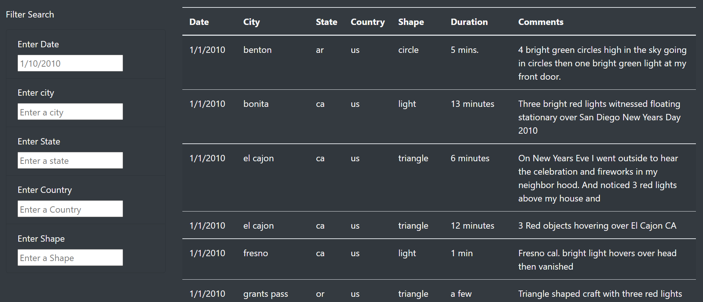

# UFOs
HTML, JavaScript and CSS analysis

## Overview of Project

Dana, a data journalist, grew up in a town that is famous for UFOs sightings. She decided to write a piece about UFOs sightings in the United States and to create a page with filters. The page contains a table with data for date, city, state, country, shape, duration, and comments. A dynamic page was created to apply multiple filtes for users to be applied at the same time for city, state, county, shape.

## Results

Users can use the page to filter for their interests. If someone lives in California, they might be more interested about the UFOs sightings closer to them. They can start by applying a filter for state and they focus on city or county. 

## Summary

It is recommended to add a filter for date. It would be useful for the user to be able to filter for dates that way they can see if there are certain time frames in which the UFO sightings are more active. 

